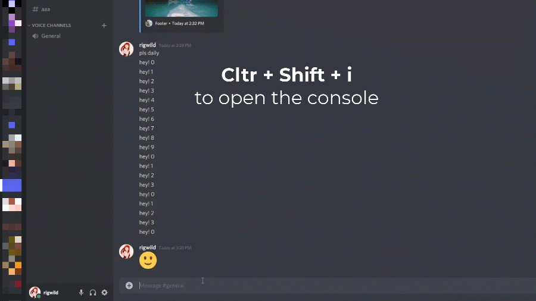

# Discord self-bot console

A simple Discord Self-bot using console. Intended for quick scripts runnable directly from the devtools. Can also be [used with Node.js](https://github.com/rigwild/discord-self-bot-console/discussions/4#discussioncomment-1438231) for quick simple scripts!

# Disclaimer

Automating user accounts is against [Discord's Terms of Service](https://discord.com/terms). You might get banned if you abuse it (too much spam, unusual activity).

# Usage

1. Close Discord client (`Quit Discord` in system tray)
2. Open the settings file, it's location depends on your OS:
   - Windows: `%appdata%\discord\settings.json`
   - macOS: `~/Library/Application Support/Discord/settings.json`
   - Linux: `~/.config/discord/settings.json`
3. Add `"DANGEROUS_ENABLE_DEVTOOLS_ONLY_ENABLE_IF_YOU_KNOW_WHAT_YOURE_DOING": true,` (this is necessary [since last update](https://www.reddit.com/r/discordapp/comments/sc61n3/comment/hu4fw5x))
4. Save the file
5. Restart Discord client
6. Open Chrome devtools on Discord using `Ctrl + shift + i`
7. Go to the console tab and paste the entire [`index.js`](./index.js) script
8. Send a message in any channel/DM, this will automatically set your auth token into the script
9. ...
10. Profit!

If you want to disable the token from being automatically set, use `autoUpdateToken = false` at the start of your bot script. You can extract the auth token manually by doing this:

6. Open Chrome devtools on Discord using `Ctrl + shift + i`
7. Go to the console tab and paste the entire [`index.js`](./index.js) script
8. Go to the network tab and send a message in any channel/DM
9. A new entry should appear, click it then copy the `Authorization` header (in the `Request Headers` section)
10. Paste it in `authHeader` at the end of the script in the console



You can now use any function provided by this script in the console like `await api.someFunction()`. Don't forget `await` or the server's response will not be printed to the console.

Use the `id()` function to update the variable `gid` guild id and `cid` channel id to what you are currently watching.

**Note:** It's a good idea to wrap your code in its own scope `{ code }` or you might get an error when reusing the same variable names later!

# Examples

## Basic example

Update `cid` to the channel you are watching, get the last 100 messages, send a message, edit then delete.

```js
{
  id()
  let channelId = cid

  // Send a message
  let sentMessage = await api.sendMessage(channelId, 'Hello!')

  await delay(2000)

  // Edit a message
  let editedMessage = await api.editMessage(channelId, sentMessage.id, 'Hello, edited!')

  await delay(2000)

  // Delete a message
  await api.deleteMessage(channelId, editedMessage.id)

  await delay(2000)

  // Log the last 100 messages
  let messages = await api.getMessages(channelId)
  console.log(messages)
}
```

## Send an embed

**SENDING EMBEDS AS A USER ACCOUNT IS NOT POSSIBLE ANYMORE, DISCORD UPDATED ITS API (see [this reddit post](https://web.archive.org/web/20220209223900/https://www.reddit.com/r/Discord_selfbots/comments/sa0hc2/discord_embeds_patched/))**

See [How to send an embed?](https://github.com/rigwild/discord-self-bot-console/discussions/6)


## Run in Node.js

See [Can I run it without opening Discord?](https://github.com/rigwild/discord-self-bot-console/discussions/4)

## Use multiple account tokens

See [Is it possible to use multiple tokens?](https://github.com/rigwild/discord-self-bot-console/discussions/21)

## Use a bot account

This specific script only works for user accounts. If you want to use a bot account, you need to use the provided Node.js version (see above).

[Why can't I use a bot account with the Discord client?](https://github.com/rigwild/discord-self-bot-console/discussions/4#discussioncomment-1999680)

## List all custom emojis urls from all guilds you are a member of

See [How to list all custom emojis urls from all guilds you are a member of](https://github.com/rigwild/discord-self-bot-console/discussions/2)

## React with emoji or custom emoji

See [How to react with emoji or custom emoji ? 🤔](https://github.com/rigwild/discord-self-bot-console/discussions/23)

## Send slash commands (/something)

See [Send slash commands (/something)](https://github.com/rigwild/discord-self-bot-console/discussions/31#discussioncomment-3442385)

## Open a thread

```js
{
  id()
  let channelId = cid

  const sentMessage = await api.sendMessage(channelId, 'Hello, please open a thread here! 💕')

  // A new thread opened in reply to a message
  const createdThread = await api.createThread(channelId, sentMessage.id, 'A cool thread 🤔')
  const sentMessage2 = await api.sendMessage(createdThread.id, 'Here it is, this is a thread! 😁')
  await api.replyToMessage(createdThread.id, sentMessage2.id, 'Thanks! ✌️')

  // A clean new thread without any message in it (not opened on any message!)
  await api.createThreadWithoutMessage(channelId, 'Another thread 😁')
}
```

## Farm XP

Send a `message` to a channel (`channelId`) every minute then delete it (useful for XP farming in some servers).

You can use `loop = false` at any time to stop it.

```js
{
  id()
  let channelId = cid
  let message = 'Hi, I like spamming 🦜'

  var loop = true
  let count = 0
  while (loop) {
    const sentMessage = await api.sendMessage(channelId, message)
    await api.deleteMessage(channelId, sentMessage.id)
    console.log(`Sent ${++count} messages`)
    await delay(61000) // 61 seconds
  }
}
```

To farm XP with multiple accounts, check [Is it possible to farm XP using multiple tokens?](https://github.com/rigwild/discord-self-bot-console/discussions/21#discussioncomment-3136195)

## Clear messages of user

Delete the `amount` messages from user (`userId`) sent to a channel/DM (`channelId`) appearing before message (`beforeMessageId`) and wait `delayMs` milliseconds everytime.

I use sometimes to fully clear my DMs as Discord does not offer it as a feature.

You can use `loop = false` at any time to stop it.

Discord recently made its rate limiting strictier. I recommend 1100ms as a minimum to not get rate limited. Make it even bigger if you are affraid of getting banned.

```js
{
  id()
  let channelId = cid
  let userId = '012345678987654321'
  let amount = 99999999
  let delayMs = 1100

  let beforeMessageId = '999999999999999999' // Leave it like this to delete from latest

  let deletionCount = 0
  var loop = true
  while (loop) {
    const messages = await api.getMessages(channelId, 100, { before: beforeMessageId })

    // We reached the start of the conversation
    if (messages.length < 100 && messages.filter(x => x.author.id === userId && (x.type === 0 || x.type === 19)).length === 0) {
      loop = false
      console.log(`[${deletionCount}/${amount}] Reached the start of the conversations! Ending.`)
      continue
    }

    // Update last message snowflake for next iteration
    beforeMessageId = messages[0].id

    for (const aMessage of messages) {
      if (loop === false) break

      // Check if the max amount was reached
      if (deletionCount >= amount) {
        loop = false
        console.log(`[${deletionCount}/${amount}] Deleted the requested amount of messages! Ending.`)
        break
      }

      // Update last message snowflake for next iteration
      beforeMessageId = aMessage.id

      // Check if the message should be deleted
      if (aMessage.author.id === userId && (aMessage.type === 0 || aMessage.type === 19)) {
        await api.deleteMessage(channelId, aMessage.id)
        deletionCount++
        console.log(`[${deletionCount}/${amount}] Deleted a message!`)
        if (deletionCount < amount) await delay(delayMs)
      }
    }
    await delay(delayMs)
  }
}
```

# FAQ

## Will I get banned if I do x?

I don't know, maybe. I have used lots of scripts in the past, often deleted 100k+ messages of mine accross private messages and servers and never got banned, ever.

But I can't guarantee anything. Use at your own risk.

Automating user accounts is againt [Discord's Terms of Service](https://discord.com/terms).

## Listen to events, do some advanced stuff

This is intended for small scripts, not to implement a full-featured bot.

If you need to listen to events or do something more advanced you can use the [discord.js](https://github.com/discordjs/discord.js) package with your user token (with v11.3.2 and below though, they deprecated user token support starting v11.4.0!).

**Note:** As they don't support user bots anymore, it may break at any time (with Discord changing their APIs).

## Can it do x? Can you help me?

Post your requests in the [Discussions](https://github.com/rigwild/discord-self-bot-console/discussions) tab. Please search if your request was not mentionned in an earlier post before asking.

## I made a nice/useful script, can I share?

Of course! Post it in the [Discussions](https://github.com/rigwild/discord-self-bot-console/discussions) tab. Please search if a similar script was shared earlier before posting.

## Why this repo?

Initially, this was posted as [a gist for myself](https://gist.github.com/rigwild/28f5d9479e3e122070e27db84e104719). As there's interest for such a thing, I figured out making a proper repo was better to share scripts.

# API

## Full list

Here is the full list of available functions, check [`index.js`](./index.js).

```js
id()
delay(ms)
api.apiCall(apiPath, body, method = 'GET')

api.getMessages(channelOrThreadId, limit?, params = {})
api.sendMessage(channelOrThreadId, message, tts?, body = {})
api.replyToMessage(channelOrThreadId, repliedMessageId, message, tts?, body = {})
api.editMessage(channelOrThreadId, messageId, newMessage, body = {})
api.deleteMessage(channelOrThreadId, messageId)

api.createThread(channelId, toOpenThreadInmessageId, name, autoArchiveDuration?, body = {})
api.createThreadWithoutMessage(channelId, name, autoArchiveDuration?, body = {})
api.deleteThread(threadId)

api.sendEmbed(channelOrThreadId, embed = { title: 'Title', description: 'Description' })

api.getRoles(guildId)
api.createRole(guildId, name)
api.deleteRole(guildId, roleId)

api.getBans(guildId)
api.banUser(guildId, userId, reason)
api.unbanUser(guildId, userId)
api.kickUser(guildId, userId)

api.addRole(guildId, userId, roleId)
api.removeRole(guildId, userId, roleId)

api.auditLogs(guildId)

api.getChannels(guildId)
api.createChannel(guildId, name, type)
api.deleteChannel(channelId)

api.pinnedMessages(channelId)
api.addPin(channelId, messageId)
api.deletePin(channelId, messageId)

api.listEmojis(guildId)
api.getEmoji(guildId, emojiId)
api.createEmoji(guildId, name, image, roles)
api.editEmoji(guildId, emojiId, name, roles)
api.deleteEmoji(guildId, emojiId)

api.searchSlashCommand(channelOrThreadId, search)
api.sendSlashCommand(guildId, channelOrThreadId, command, commandOptions = [])

api.changeNick(guildId, nick)
api.leaveServer(guildId)

api.getDMs()
api.getUser(userId)

api.getCurrentUser()
api.editCurrentUser(username?, bio?, body = {})
api.listCurrentUserGuilds()

api.setCustomStatus(emojiId?, emojiName?, expiresAt?, text?)
api.deleteCustomStatus()

api.listReactions(channelOrThreadId, messageId, emojiUrl)
api.addReaction(channelOrThreadId, messageId, emojiUrl)
api.deleteReaction(channelOrThreadId, messageId, emojiUrl)

api.typing(channelOrThreadId)
```

## `delay(ms)`

`delay(ms: number) => Promise<void>`

Wait for `ms` milliseconds.

```js
await delay(1500)
```

## `id()`

`id() => void`

Update the variable `gid` guild id and `cid` channel id to what you are currently watching in the Discord client.

```js
id()
```

## Variables

- `authHeader`: You Discord account auth token
- `autoUpdateToken`: If true, the token will be automatically updated in the bot when a request is sent from the client (e.g sending a message)
- `gid`: Current guild id (update to what you are currently watching using `id()`)
- `cid`: Current channel id (update to what you are currently watching using `id()`)

# License

[The MIT License](./LICENSE)
